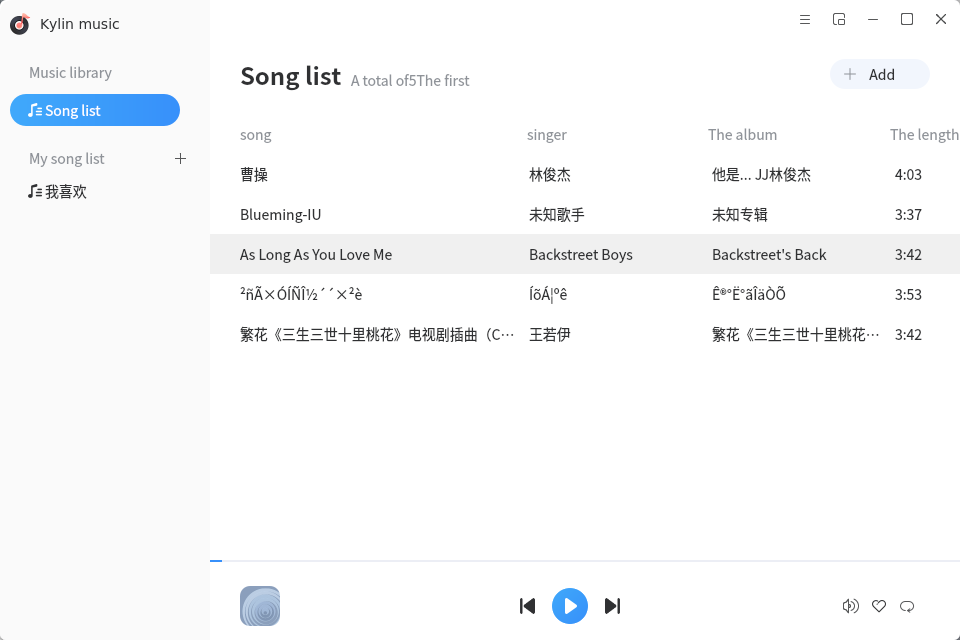

# Kylin Music
## Overview
Kylin Music is a simple to use, user-friendly, support.mp3,.ogg,.wma,.spx,.flac and other music formats music player. While playing local music, you can also group music by custom playlists according to your preferences. In addition to the regular mode, Kirin Music also has a small window mode to meet the different needs of users.

 

## Songs List page

 

The song list page after adding the songs is shown in the Fig.below.

 

 

### Feature introduction
    You can select the control area for play/pause, previous track, next track and so on.

 

## Right click on the song

 

You can select a song to add to my like, delete, view the song information and other operations.

 

### Feature introduction

 

Select the right button to add to your favorite playlist, delete songs, view song information and other operations.

 

 

## Toggle mini mode
You can switch the Mini window for better user experience.

 

